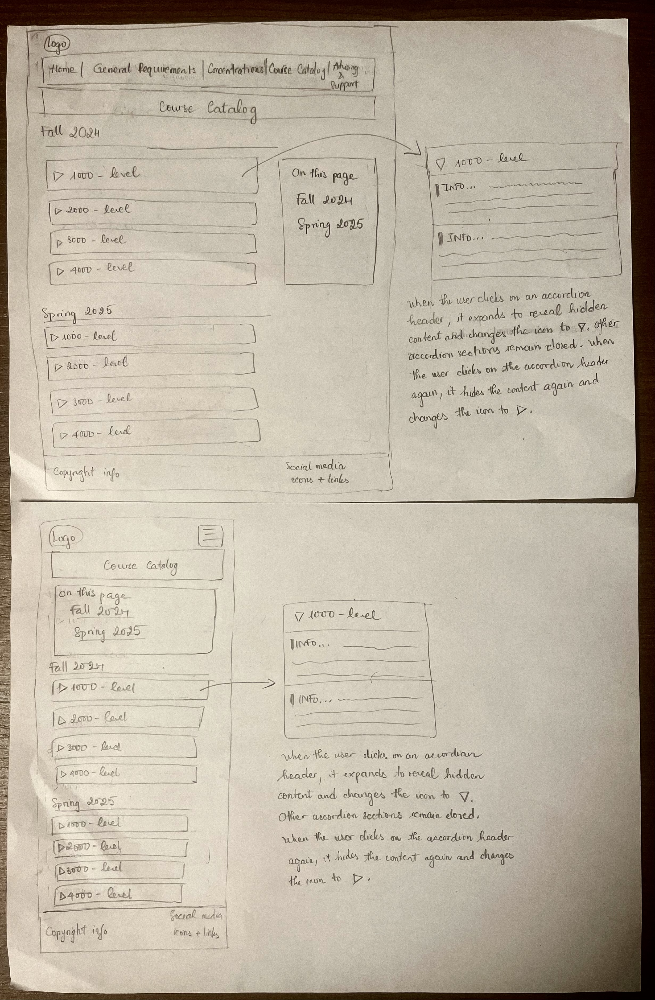
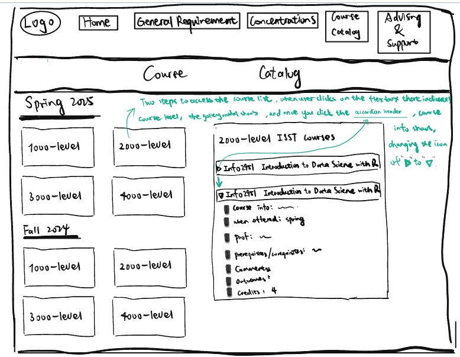
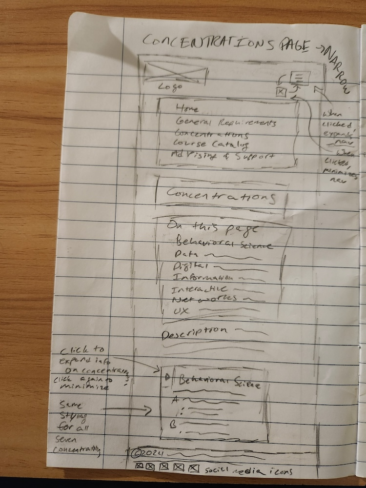
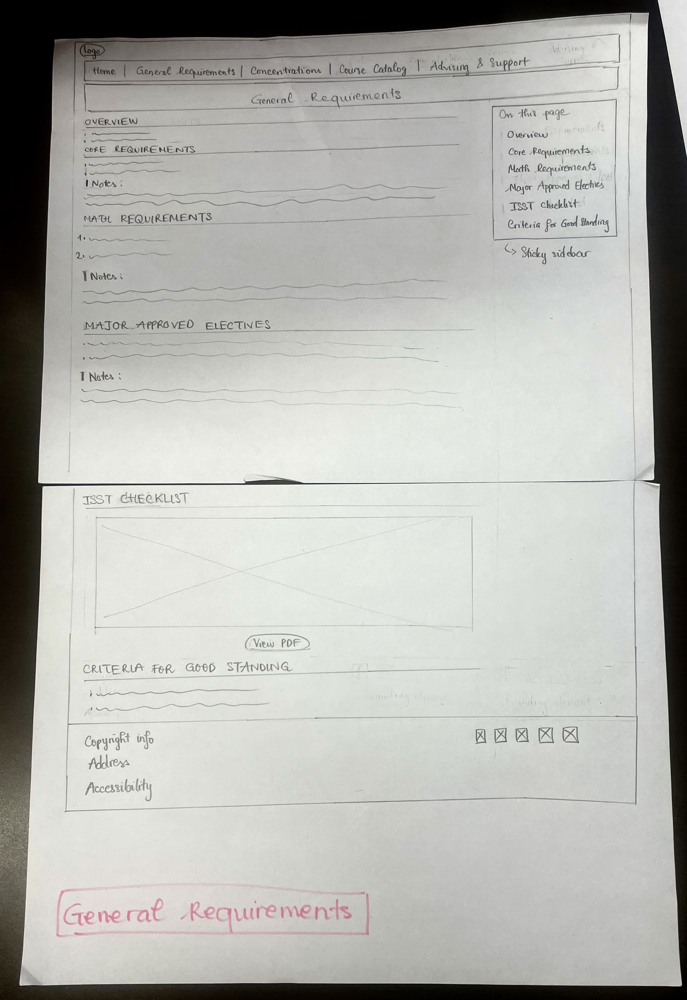

# Group Project, Milestone 2: Design Journey

## Milestone 1 Revisions

We added the list of courses per concentration to better meet our client's goals of learning about the different concentrations offered. However, we deleted the headshots of advisors because they weren't provided by the client and we didn't get permission from the advisors for their headshots.

## Content Organization

**Iteration 1**:

In this iteration, we structure the content to guide users from a general introduction of the major to detailed requirements and advisor information. The About page provides an overview of the major, while the Degree Requirements page outlines degree requirements/structure that apply to every student in the major (core, math, electives). The Concentration Requirements page breaks down specific pathways within the major with course listings; the Advisor Information page includes contact details and advisor headshots to offer a information that students can use to connect with advisors.

**Iteration 2**

In this iteration, we structure content in five pages including Home, General Requirements, Concentrations, Course Catalog, and Advising & Support. The Home page gives a short introduction to the department and the ISST major with images of the CIS and ISST students. The General Requirements is an overview of ISST major requirements with core courses, math and electives (these requirements apply to everyone in the major) with an image & a PDF file of the checklist. The Concentration page introduces each concentration and goes into detail the lists of courses that fall under each concentration (students choose different concentrations so we make it a separate page). The Course Catalog page gives our audience a space to navigate themselves with lists of courses for requirements with avilability, professor and descriptions so that they won't have to go to a different website. Finally, the Advising & Support Page is about advisors' contact information.

## Final Content Organization

We are using the second iteration of card sorting for our website.

In our first iteration, detailed information on the courses was on the same page as the breakdown of general degree requirements and concentrations, which was a lot to throw at the user all at once, while in our second iteration, we moved this content to a new page, the course catalog, so that we could provide a simplified version of the general degree requirement and concentration pages – this will allow our user to find information more quickly and without feeling quite so overwhelmed. Consistent in both iterations are our Home page and our Advising & Support page, which provide information about the major (in a general sense) and about a crucial resource available to students (meetings with advisors) – this fulfills our audience goals by giving them streamlined access to tools that they might need as they navigate their major and ultimately if they decide to affiliate.

## Navigation

- Home
- General Requirements
- Concentrations
- Course Catalog
- Advising & Support

These names make sense because they sum up the content that will be offered by each of these pages – the Home page will be sort of the base of operations, with general information about the department, the major and potential careers that majors can look at; the General Requirements page will contain information about core, math, and elective requirements, along with a list of the courses that can be used to satisfy each of them; the Concentrations page will contain information about each of the concentrations and a list of the courses that can be used to satisfy each of them; the Course Catalog page will contain a list of all the courses mentioned on the previous pages, along with more detailed information about them (such as descriptions of what is covered in the course, semester, instructor, number of credits); and the Advising & Support page contains contact information of the advisors and information as to how to set up meetings with them. Therefore, the names of these pages address the goals of our site's audience while making it clear what content can be found on what page.

## Example Website 1

<https://ischool.uw.edu/>

Narrow Screenshot

Wide Screenshot

**Goals of the audience**: The audience has the goals of learning about the academic programs offered by the Information School, and the different opportunies such as events, news, and research.

**What we like**: We like the colors they chose because it's distinct to the schools reputation, we like the use of decorative imagery, we like their use of gallery interactivity, and we like that the logo goes to the university home page. We also like that the navigation bar turns into a hamburger menu when the screen gets narrow because it follows common design patterns.

## Example Website 2

<https://csd.cmu.edu/academics/bachelors/overview>

Wide screenshot

Narrow screenshot

**Goals of the audience**: One important goal that audiences likely have when visiting this site is to see what bachelor programs are offered by Carnegie Mellon's School of Computer Science and to access specific information regarding the curriculum, what courses are offered to satisfy the components of the curriculum, and any other information pertinent to the program that they are interested in or already part of.

**What we like**: The font size used in this website allows the audience to easily see what the page is about. The type of colours used is also  the best because they are not too sharp or piercing. This page also has anchors in the sidebar that lead to other pages on the website.

## Interactivity Brainstorm

- Hamburger menu for narrow screens of each webpage: make it easier to access the content faster without having to scroll past a long vertical menu, saving more space for audience.
- Modal for PDF checklist: audience can better utilize the checklist by accessing the enlarged version of the checklist to check for details.
- Modal for flowchart of general ISST requirements: fonts within flowcharts are small, so having a bigger version of flowchart would allow audience to see more details clearly.
- Accordian for course catalog: it is easier to access the content by saving more space for audience.
- Image gallery for decorative images in Home page: there will be small thumbnails and when users click on the thumbnail, a corresponding larger image will show up. It helps users view images more in detail if they want.

## Design Exploration

The hamburger menu is a design that many websites employ – the symbol should be reasonably familiar to users of the web, which makes it a good design choice because it employs pre-existing familiar web design. It allows us to collapse the navigation menu in the narrow view, with the user having the choice to open it up at any time when they want to. This is important because it minimizes the vertical space taken up by the navigation bar in the narrow view, which reduces the amount that the user needs to scroll in the narrow view to actually get down to the content, thereby minimizing their frustration and the time it takes for them to find the information that they need.

The hamburger menu that is familiar among many narrow screen websites. It allows users to condense and expand the navigation menu. This is a second iteration for exploring possible hamburger menu designs. This design is similar to the last one, but for this one, there is no x button. Instead, the original hamburger menu button can be clicked again to condense the menu.

I include accordions and divide the content into 2 semesters (fall, spring) and then 4 levels (1000, 2000, 3000, 4000). By grouping courses into collapsible sections for each semester and level, users can quickly scan for courses relevant to their academic standing/level and the semester they're planning for without going through unrelated options.

I included a carousel for this iteration because it will allow us to include more picture content for this which the audience can interact with. Also the carousel provides an interactive way to showcase multiple pieces of content without overwhelming the user with too much information at once. It allows for a clean, organized design while keeping the homepage dynamic and engaging.

I include an accordion header and a gallery modal as the interactivity on Course Catalog Page. By grouping all courses into four blocks/boxes indicating four different levels, it saves space for audience since it only includes four blocks under each heading of certain semester. And you can expand or access the more course info by clicking on the box which then gives you a bigger image with the accorion header and the course info underneath.

## Final Entire Website's Narrow Design

## Final Entire Website's Wide Design

## Design Rationale

Our design is appropriate for our audience because it addresses their goals by splitting up the pages according to the sections that were emphasized during the interviews, and each section is titled according to its category and displayed on the navigation menu. This makes the website easy to navigate and for users to find the information they are looking for quickly. Each web page also has a side bar with anchors, which makes it easy for users to navigate the content within each web page as well. The site design also follows familiar web design patterns to make the website more predictable and useable for users. Each page has a side bar with anchors, navigation bar, title, logo that links to the home page, and footer. All of these design choices make our website appropriate and familiar for our audience.

- For the final design  we look forward to including the headshot of the advisors on the advising and support page. For now we haven't been given full permission to use the images of the advisors (hence the images have been commented in the html). When granted permission the headshots will be contained in the same div with the contact information of the advisors in order to facilate faster retrieval of information about a particular advisor. The design employed here is familiar to many advising and academic support pages on websites of many colleges.
- The course codes in the General Requirements page are bold to emphasize the courses everyone in the major has to take.

## Interactivity Rationale

The **home page** has an image gallery that enlarges the image (thumbnail) that the users select, which addresses the audience's goals of learning more about the ISST major by seeing what life as an ISST major looks like through images. It enhances their experience because they don't have to scroll past all the images, and instead, they can just look at the ones they are interested in.

The **concentrations page** uses accordions that allow the user to expand and minimize the information for each concentration. These address the goals of our site's audience by allowing us to keep all of the content for the concentrations on one single page without overwhelming the user or making the page absurdly long and difficult to navigate (even with the sidebar with anchors). It enhances their user experience by allowing them to decide what information is made available on the webpage at any given point, which they can tailor to their needs (for example, if they need to compare two different concentrations, they can open both of them, but if they are only looking at one, then they can close every accordion except that one). All in all, this keeps the information on the page from overwhelming the user.

The **Course Catalog page** uses accordions that allow users to click and expand the available curriculums and the detailed info such as instructors, comments, prerequisites of certain course. Without such accordion interactivity design, the number of courses and information would take too much space and too much vertical scrolling. So adding this accordion would really help audience to save space and look at the semester they are interested in.

All of the pages in the narrow view have hamburger menu that can be used to expand and minimize the navigation menu. This allows users to control when it is visible and when it is not, which is important because it saves space and allows users to find the information that they're looking for on any given page more easily in the narrow view. This is not necessary in the wide-screen view because the navigation menu expands into something that takes up relatively less vertical space. Therefore, this interactivity furthers the user goals by making the webpage shorter and therefore more readable in the narrow-screen view, while giving the user control over whether or not the navigation menu is displayed at any given moment.

## References

We used this site as a reference for HTML and CSS:
<https://developer.mozilla.org/en-US/docs/Web/HTML>

We used the following client provided content:

- <https://cornell.app.box.com/s/qztbo9l2w5gvwy3ikwus74f0zsdbpt71/file/1682715743100>
- <https://cornell.app.box.com/s/qztbo9l2w5gvwy3ikwus74f0zsdbpt71/file/1682735792931>
- <https://infosci.cornell.edu/undergraduate/info-sci-majors>
- <https://infosci.cornell.edu/undergraduate/info-sci-majors/bs-information-science-systems-and-technology>
- <https://infosci.cornell.edu/about/contact-us>

[← Table of Contents](design-journey.md)
