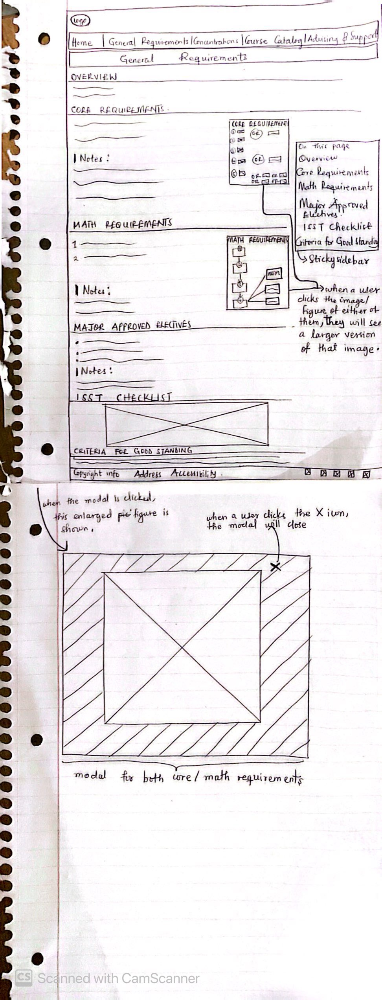
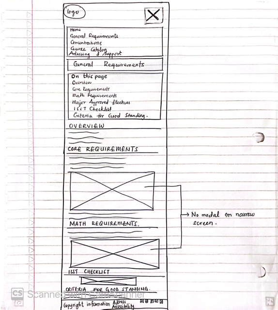
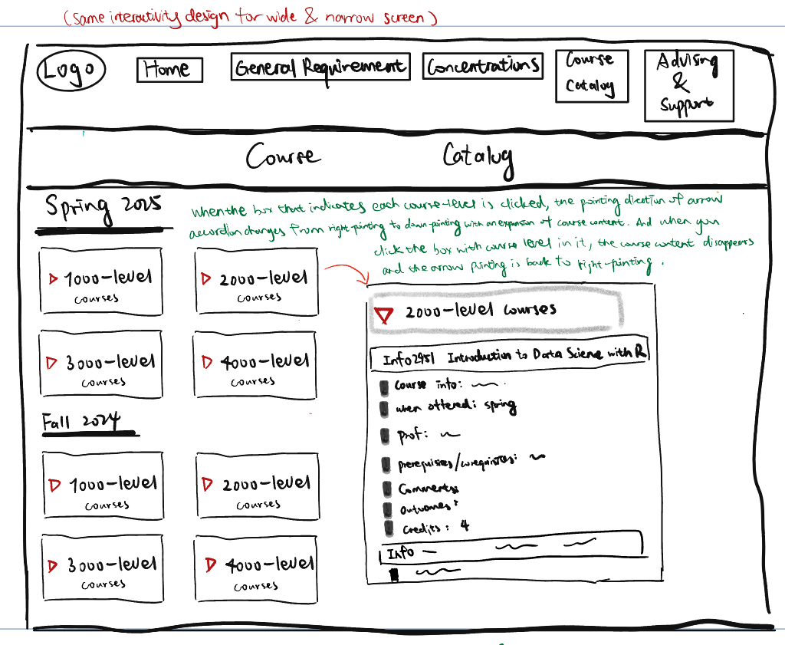
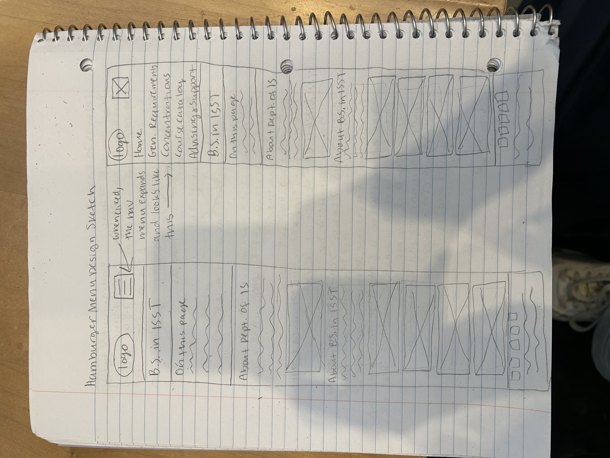
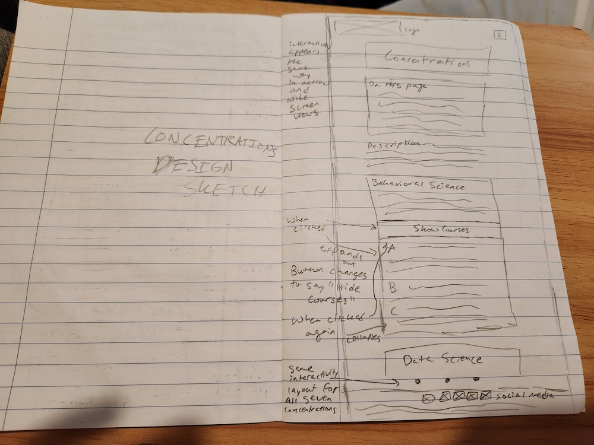
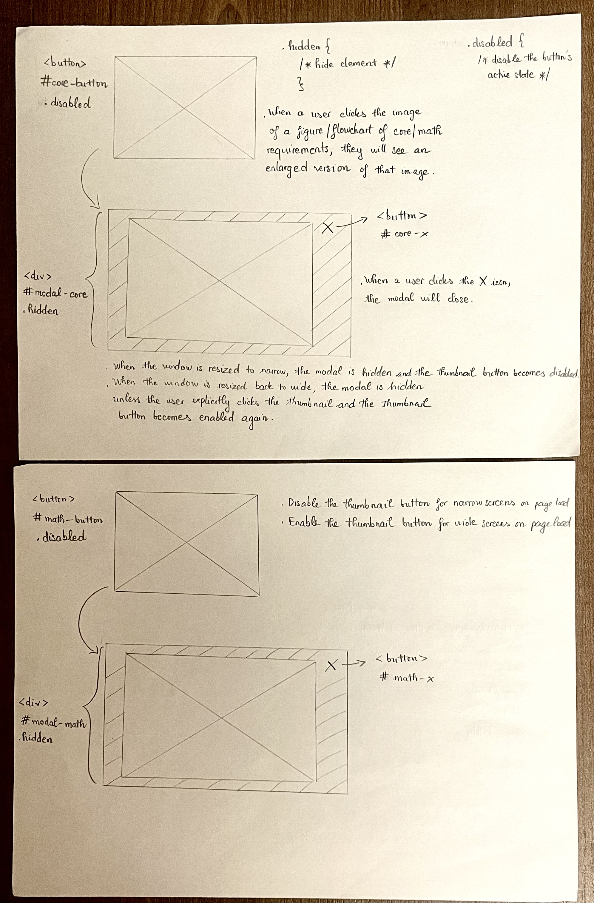
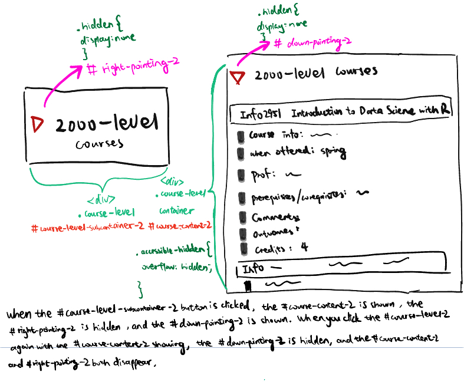
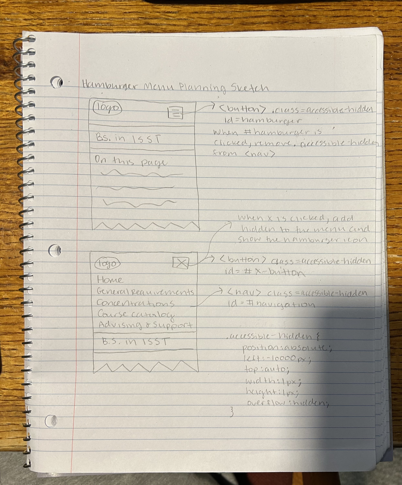
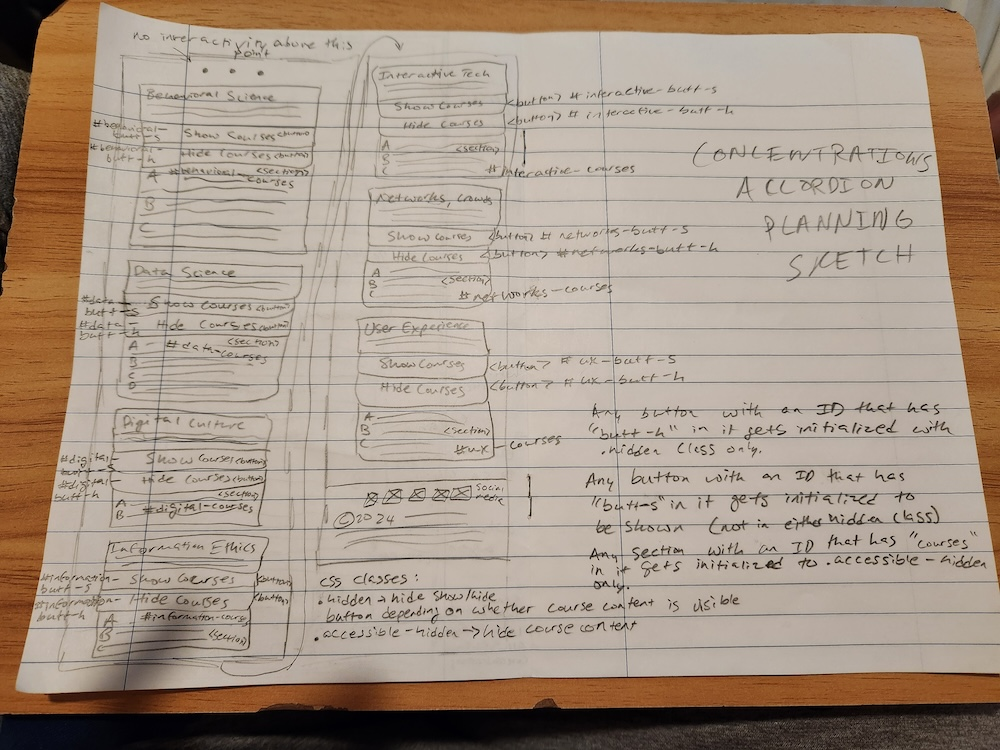

# Group Project, Final Milestone: Design Journey

[← Table of Contents](design-journey.md)


## Milestone 2 Feedback Revisions
> Explain what you revised in response to the Milestone 2 feedback (1-2 sentences)
> If you didn't make any revisions, explain why.

We deleted the interactivity for the gallery on the homepage because it didn't seem like it was helping with the audience goals, and also added 2 modals for the figure/flowchart of the core/math requirements on the "General Requirements" page so that students can better visualize how the requirements look like. We also changed the layout of the Concentrations page slightly, moving the descriptions for each concentration outside of the interactive button and changing the styling of the button so that it better indicates where the hidden content will appear (below the button).


## Interactivity Plan
> List the types of interactivity you plan to include in your project.
> Provide a brief summary (a few words) for each type of interactivity you plan to implement.

- Hamburger menu: the hamburger menu for the narrow screen will allow the auidence to open and close the navigation to allow them to access the content of each page faster without having to scroll past a navigation menu every time.
- 2 modals for the figure/flowchart of the core/math requirements on the "General Requirements" page: The fonts, shapes, and arrows in the figure/flowchart are small and the image for it is just currently a thumbnail next to the list of courses. Therefore, offering a larger version of the figure/flowchart would help users view the details more clearly and better understand the structure of the requirements. We only implement these modals for wide screens but not narrow screens because screen space is limited on narrow screens so modals would be impractical and disruptive. The figures for the modals are already big on narrow screens so modals are unnecessary on narrow screens.
- Concentrations Accordion: On the "Concentrations" page, there would be an accordion below each of the seven concentrations – when you click on the button below the description of the concentration, it expands with information on the courses specific to that concentration. The text on the button changes to say "Hide Courses" and when clicked again, it collapses the accordion. This serves our user goals by keeping all the information pertinent to each concentration on a single page, while also keeping the page from being too complicated and long by giving the user the ability to control what information is and isn't displayed at a given moment.
- Cours Catalog Accordion: On the "Course Catalog" page, there would be an accordion in which clicking the arrow would change the direction of where the arrow is pointing and expand the course list underneath each course level.


## Interactivity Design Sketches
> Create design sketch(es) to plan your interactivity's design.
> **Sketch out where your interactivity will go on the page itself.**
> For example, do not just sketch a carousel; instead, sketch the carousel on the page where it will appear.
> Add annotations to explain what happens when the user takes an action. (This is not pseudocode.)
> Include as many sketches as necessary to communicate your design (ask yourself, could another 1300 take these sketches an implement my design?)

**Modal design sketches**



**Accordion on course catalog page design sketches**:


**Hamburger menu design sketch**


**Concentrations accordion design sketch**



## Interactivity Planning Sketches
> Produce planning sketches that include all the details another 1300 student would need to implement your design.
> Your planning sketches should include _all_ HTML elements needed for the interactivity; _annotations_ for the element types, their unique IDs, and CSS classes; and lastly the initial CSS classes.

**Modal planning sketches:**


**course-catalog page**:


**Hamburger menu planning sketch:**


**Concentrations accordion planning sketch**



## Interactivity Pseudocode Plan
> Write your interactivity pseudocode plan here.
> Pseudocode is not JavaScript. Do not put JavaScript nor snippets code here.

**Modal pseudocode**:

> Pseudocode to open the modal:

```
when #core-button is clicked (event):
  remove .hidden from #modal-core
when #math-button is clicked (event):
  remove .hidden from #modal-math
```

> Pseudocode to close the modal:

```
when #core-x is clicked (event):
  add .hidden to #modal-core
when #math-x is clicked (event):
  add .hidden to #modal-math
```

> Pseudocode to disable the thumbnail button if the browser window is narrow when the page loads and enable the thumbnail button if the browser window is wide when the page loads:

```
on page load:
  if window is narrow:
    add .disabled to #core-button
    add .disabled to #math-button
  else:
    remove .disabled from #core-button
    remove .disabled from #math-button
```

> Pseudocode to hide the modal and disable the thumbnail button when resized to narrow screens (when resized to wide screens again, the modal is hidden until the user explicitly triggers it and the thumbnail button is re-enabled):

```
on window resize:
  if window is narrow:
    add .hidden to #modal-core
    add .hidden to #modal-math
    add .disabled to #core-button
    add .disabled to #math-button
  else:
    remove .disabled from #core-button
    remove .disabled from #math-button
```

**Hamburger Menu pseudocode**:

```
when the hamburger button is clicked:
  if #navigation has .accessible-hidden:
    remove .accessible-hidden from #navigation
    add .accessible-hidden to #hamburger
    remove .accessible-hidden from #x-button
  else:
    add .accessible-hidden to #navigation
    add .accessible-hidden to #x-button
    remove .accessible-hidden from #hamburger
```

```
when the #x-button button is clicked:
  if #navigation has .accessible-hidden:
    add .accessible-hidden to #navigation
    remove .accessible-hidden from #hamburger
    add .accessible-hidden to #x-button
  else:
    remove .accessible-hidden from #navigation
    remove .accessible-hidden from #x-button
    add .accessible-hidden to #hamburger
```


```
on page load (ready):
  if window is narrow:
    remove .accessible-hidden from #hamburger
    add .accessible-hidden to #navigation
    add .accessible-hidden to #x-button
  else if window is wide:
    add .accessible-hidden to #hamburger
    remove .accessible-hidden from #navigation
    add .accessible-hidden to #x-button
```

```
on window resize:
  if window is narrow:
    add .accessible-hidden to #hamburger
    remove .accessible-hidden to #x-button
    remove .accessible-hidden from #navigation
  else if window is wide:
    add .accessible-hidden to #hamburger
    add .accessible-hidden to #x-button
    remove .accessible-hidden from #navigation
```

**Concentrations Accordion pseudocode**:
> Pseudocode to hide all course information on the Concentrations page and initialize all the buttons to say "Show Courses" when the page is loaded:

```
on page load (ready):
  add .accessible-hidden to #behavioral-courses
  add .accessible-hidden to #data-courses
  add .accessible-hidden to #digital-courses
  add .accessible-hidden to #information-courses
  add .accessible-hidden to #interactive-courses
  add .accessible-hidden to #networks-courses
  add .accessible-hidden to #ux-courses

  remove .hidden from #behavioral-butt-s
  add .hidden to #behavioral-butt-h

  remove .hidden from #data-butt-s
  add .hidden to #data-butt-h

  remove .hidden from #digital-butt-s
  add .hidden to #digital-butt-h

  remove .hidden from #information-butt-s
  add .hidden to #information-butt-h

  remove .hidden from #interactive-butt-s
  add .hidden to #interactive-butt-h

  remove .hidden from #networks-butt-s
  add .hidden to #networks-butt-h

  remove .hidden from #ux-butt-s
  add .hidden to #ux-butt-h
```

> Pseudocode to show course information on the Concentrations page when a given button is clicked (using behavioral science as an example for all seven):

```
when #behavioral-butt-s is clicked (event):
  add .hidden to #behavioral-butt-s
  remove .hidden from #behavioral-butt-h
  remove .accessible-hidden from #behavioral-courses
```

> Pseudocode to hide course information on the Concentrations page when a given button is clicked (using behavioral science as an example for all seven):

```
when #behavioral-butt-h is clicked (event):
  add .hidden to #behavioral-butt-h
  remove .hidden from #behavioral-butt-s
  add .accessible-hidden to #behavioral-courses


***Course Catalog Accordion pseudocode**:

> Pseudocode to show course content when the course level button is clicked and hide when it gets clicked again:
when #course-level is clicked:
  if #course-content is not visible:
    remove .accessible-hidden from #course-content
    add .hidden to #right-pointing
    remove .hidden from #down-pointing
  else:
    add .accessible-hidden to #course-content
    remove .hidden from #right-pointing
    add .hidden to #down-pointing
```

> Pseudocode to hide all course content the course catalog page and initialize all the buttons when the page is loaded:

```
on page load (ready):
  if window is narrow:
    add .accessible-hidden to #course-content
    add .hidden to #down-pointing
    remove .hidden to #right-pointing

  else if window is wide:
    add .accessible-hidden to #course-content
    add .hidden to #down-pointing
    remove .hidden to #right-pointing
```

## Interactivity Usability Justification
> Explain how the interactivity _functionally_ improves the user's experience and helps them accomplish their goals. (i.e. Your interactivity does _more_ than add additional clicks; the interactivity doesn't insert additional barriers for the user when working towards their goals.)
> Explain how your interactivity's design effectively uses affordances, visibility, feedback, and familiarity.
> Write a paragraph (3-4 sentences)

**Hamburger Menu**
The hamburger menu helps meet the users goals by helping them access the content of the website faster without having to scroll past a navigation menu. The outline around the button shows affordances because they give users a clue about where the interactivity is. It uses visibility because all the elements of the hamburger menu like the hamburger button and x button are visible. When the user performs an action such as clicking a button, there is immediate feedback because the menu expands and closes. The hamburger menu also follows common design patterns because the hamburger button opens the menu, and the x button closes it, which is a pattern seen across many websites.

**Modals**: The modals functionally improves the students' experience because by offering a larger version of the figure/flowchart when clicked, students can better easily understand the structure of the core and math requirements, which would otherwise be difficult to decipher from a small thumbnail. The modals leverage affordances by using interactive elements such as images with borders (styled as a button) for opening the modals and the X icon for closing them. Visibility is satisfied because the open action is visible with the hover effect on the thumbnails for the modals and the close action is visible with the X icon buttons at the top right of the modals. Feedback is provided as the modals appear immediately when the corresponding thumbnails are clicked and the closing actions also happen instantly when the X icon is clicked. The use of modals for additional content without leaving the current page is pretty familiar and intuitive; most users are also accustomed to closing actions using the X icon.

**Concentrations page Accordion**: The accordion on the Concentrations page functionally improves the users' experience by allowing for a large amount of information (the list of courses for each of the seven concentrations) to be on a single page, while also avoiding overwhelming the user with the sheer amount of content by giving them the ability to control what information is visible based on what information they actually want to access at a given time. This is not just something to impress; this is something that is crucial to creating an enjoyable and functional experience for the user. An affordance employed is the labels on the buttons ("show Courses" and "Hide Courses") which tell the user what the button does. Visibility is also a principle that is obeyed by the design – the button is visible in an accessible manner to the user when the user needs it (the show button is present when the content is hidden, and the hide button is present when the content is shown). Two types of feedback are the change in color of the button when the user hovers over it, as well as the appearance or disappearance of the content when the button is clicked. The design employs familiar sorts of patterns – it differs a little from the design of the other accordion on the Course Catalog page, but that is because with the concentration descriptions needing to be present at all times, using an arrow was a little awkward. Using a button at the bottom of the descriptions served as a better indication that the hidden content would appear below the description.

**Course Catalog Accordion**
The accordion design prioritizes user efficiency by transforming an overwhelming course catalog into a clean, modular interface where students can selectively expand information relevant to their interests. By allowing users to click the entire course level area—not just a small arrow—the interface maximizes interaction space and reduces precision requirements, making course exploration more accessible and intuitive. This approach strategically uses progressive disclosure, enabling students to navigate course offerings without visual fatigue and focus their attention on specific course levels or semesters they're currently investigating. The full-width clickable area provides clear affordances, immediate visual feedback, and leverages familiar web interface conventions, ultimately empowering users to explore academic offerings efficiently and with minimal cognitive load.

## References

### Collaborators
> List any persons you collaborated with on this project.
N/A


### Reference Resources
> Did you use any resources not provided by this class to help you complete this assignment?
> List any external resources you referenced in the creation of your project. (i.e. W3Schools, StackOverflow, Mozilla, etc.)
>
> List **all** resources you used (websites, articles, books, etc.), including generative AI.
> Provide the URL to the resources you used and include a short description of how you used each resource.

The class slides, the accessibility checklist, the provided JavaScript snippets, MDN reference docs, W3Schools validation tool.


[← Table of Contents](design-journey.md)
